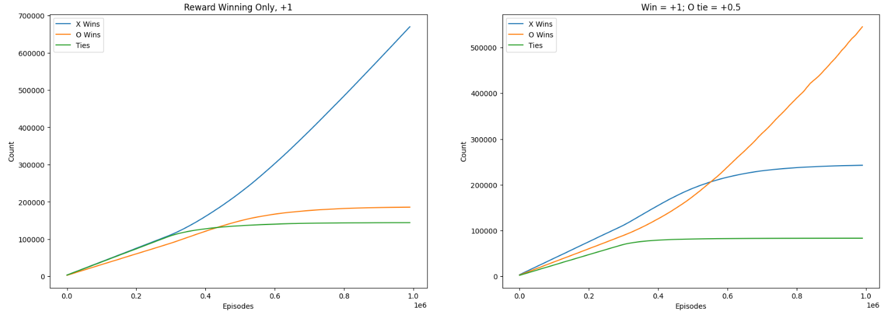
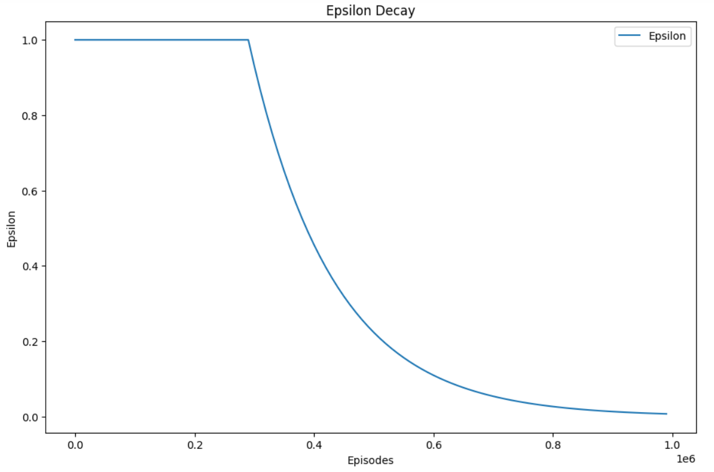

# Classic Tabular Q-Learning, Learning TicTacToe with adversarial leraning
X and O trained simultaneously by playing against each other, 1 million times (X always plays first)

### The training algorithm:


```
#create empty board
s_x-turn = environment.reset()

For each episode:
  #X's choice
  X chooses a from state s_x-turn using e-greedy, producing x_reward, s_o-turn'

  #update O
  if not first turn: 
    Q(s_o-turn,a) = Q(s_o-turn,a) + lr * (o_reward + gamma*max_a'Q(s_o-turn',a') - Q(s_o-turn,a))

  s_o-turn = s_o-turn'

  #O's choice
  O chooses a from state s_o-turn using e-greedy, producing o_reward, s_x-turn'

  #update X
  Q(s_x-turn,a) = Q(s_x-turn,a) + lr * (x_reward + gamma*max_a'Q(s_x-turn',a') - Q(s_x-turn,a))

  s_x-turn = s_x-turn'
```

### Experiments:
* Reward both X and O +1 for winning
* In addition, reward O +0.5 for a tie



### Epsilon Decay Schedule



### Example of Me playing as O against learned X_policy
```
test_env.reset()
test_env.play_against_policy(X_policy, mode='O', deterministic=True)

  |   |  
---------
  |   |  
---------
  |   |  
press enter for ai move

  |   |  
---------
  | X |  
---------
  |   |  
choose your move (0-8)
1
  | O |  
---------
  | X |  
---------
  |   |  
press enter for ai move

X | O |  
---------
  | X |  
---------
  |   |  
choose your move (0-8)
8
X | O |  
---------
  | X |  
---------
  |   | O
press enter for ai move

X | O |  
---------
X | X |  
---------
  |   | O
choose your move (0-8)
5
X | O |  
---------
X | X | O
---------
  |   | O
press enter for ai move

X | O |  
---------
X | X | O
---------
X |   | O

##notice that it not only plays optimally, but forks me in doing so
```
